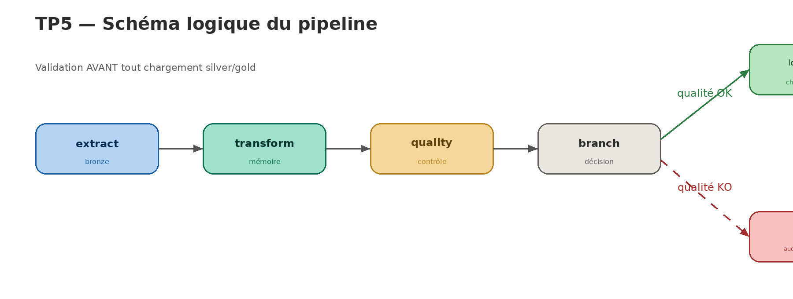

# TP 5 — Industrialisation d'un pipeline Airflow Open-Meteo

Pipeline Airflow robuste, observable et relançable autour de l'API Open-Meteo.
Il récupère la météo de plusieurs villes, archive le brut, transforme, contrôle
la qualité, décide conditionnellement du chargement final, puis trace l'exécution.

---

## Description du pipeline

Le pipeline suit une architecture en couches **bronze → silver → gold** avec un
**contrôle qualité bloquant** placé avant le chargement final. Selon le verdict
qualité, le workflow emprunte soit le chemin nominal (chargement gold), soit le
chemin d'alerte (chargement bloqué, anomalie tracée).

Chaque étape a une responsabilité unique. La logique métier vit dans des modules
Python séparés (`include/`), les requêtes dans des scripts SQL séparés (`sql/`),
et le DAG se limite à l'orchestration.

---

## Schéma du workflow



```
extract_api_payload → transform_payload → run_quality_checks → decide_branch
   (archivage bronze)   (en mémoire)        (AVANT chargement)        │
                                                                      ├── (qualité OK) → load_silver → load_gold_metrics ─┐
                                                                      └── (qualité KO) → raise_quality_alert ─────────────┤
                                                                                                            join_paths ───┘
                                                                                                                 ↓
                                                                                                       log_ingestion_run
```

> **Principe clé :** la validation qualité s'exécute **avant toute écriture
> silver/gold**. Si la qualité échoue, aucune donnée n'est chargée. Seul `bronze`
> est écrit en amont, car c'est l'archivage de la preuve source (rôle du bronze).

---

## Structure du projet

```
tp5/
├── dags/
│   └── weather_pipeline.py        # Orchestration uniquement
├── include/                        # Logique métier (modules Python séparés)
│   ├── extract.py                 # Appels API Open-Meteo
│   ├── transform.py               # Normalisation des champs
│   ├── quality.py                 # Contrôles qualité
│   └── db.py                      # Accès PostgreSQL + chargement des SQL
├── sql/                            # Requêtes SQL séparées
│   ├── init_db.sql                # Schémas + tables
│   ├── insert_bronze.sql
│   ├── insert_silver.sql          # Upsert idempotent
│   ├── upsert_gold.sql            # Upsert idempotent
│   ├── insert_quality_result.sql
│   └── insert_ingestion_run.sql
├── docker-compose.yml
├── schema_pipeline.png
└── README.md
```

---

## Variables Airflow utilisées

| Variable         | Rôle                                              | Valeur par défaut          |
|------------------|---------------------------------------------------|----------------------------|
| `weather_cities` | Liste des villes à interroger (nom + GPS), en JSON | Paris, Lyon, Marseille     |

Exemple de valeur (Admin → Variables) :
```json
[
  {"name": "Paris",     "latitude": 48.8566, "longitude": 2.3522},
  {"name": "Lyon",      "latitude": 45.7640, "longitude": 4.8357},
  {"name": "Marseille", "latitude": 43.2965, "longitude": 5.3698}
]
```

Si la variable n'est pas définie, le DAG utilise la liste par défaut.

---

## Connexions Airflow utilisées

| Connection Id      | Type     | Détails                                            |
|--------------------|----------|----------------------------------------------------|
| `weather_postgres` | Postgres | Host `postgres-metier`, db `weather_db`, port `5432` |

À créer dans Admin → Connections :

| Champ           | Valeur             |
|-----------------|--------------------|
| Connection Id   | `weather_postgres` |
| Connection Type | `Postgres`         |
| Host            | `postgres-metier`  |
| Database        | `weather_db`       |
| Login           | `weather`          |
| Password        | `weather`          |
| Port            | `5432`             |

---

## Description des tâches du DAG

| Tâche                 | Type                  | Rôle                                                                      |
|-----------------------|-----------------------|---------------------------------------------------------------------------|
| `extract_api_payload` | PythonOperator        | Appelle Open-Meteo pour chaque ville, archive le brut en `bronze`        |
| `transform_payload`   | PythonOperator        | Normalise les champs **en mémoire** (aucune écriture en base)            |
| `run_quality_checks`  | PythonOperator        | Contrôle qualité **avant chargement**, trace le verdict dans `technical` |
| `decide_branch`       | BranchPythonOperator  | Branche vers le chargement (qualité OK) ou l'alerte (qualité KO)         |
| `load_silver`         | PythonOperator        | Chemin nominal : upsert idempotent dans `silver` (après validation)      |
| `load_gold_metrics`   | PythonOperator        | Chemin nominal : upsert des agrégats journaliers dans `gold`             |
| `raise_quality_alert` | PythonOperator        | Chemin d'alerte : journalise l'anomalie, **aucune écriture de données**  |
| `join_paths`          | EmptyOperator         | Point de convergence des deux chemins                                     |
| `log_ingestion_run`   | PythonOperator        | Trace l'exécution globale dans `technical.ingestion_runs`                |

---

## Stratégie de robustesse

La robustesse cible les **incidents temporaires** sans masquer les **échecs structurels**.

| Mécanisme            | Application                                        | Justification                                              |
|----------------------|----------------------------------------------------|------------------------------------------------------------|
| `retries=2`          | Tâches par défaut (extract, transform)             | Un incident réseau ou une API momentanément indisponible se résout souvent au 2ᵉ essai |
| `retry_delay=1 min`  | Tâches par défaut                                  | Laisse le temps à la ressource externe de revenir          |
| `execution_timeout`  | 2 min sur `extract`, 5 min par défaut              | Évite qu'un appel API bloqué attende indéfiniment          |
| `retries=0`          | `run_quality_checks`, `raise_quality_alert`, `log` | Une anomalie qualité est un échec **structurel** : relancer ne corrige rien |
| Timeout réseau 10 s  | Appels `requests` dans `extract.py`                | Coupe un appel API qui ne répond pas                       |

Le principe vu en cours est respecté : on n'ajoute pas de retries partout.
Les tâches dont l'échec relève d'un problème de logique (qualité) ne sont pas relancées.

---

## Stratégie d'idempotence

L'objectif : **relancer le DAG (ou une tâche) ne crée jamais de doublon**.

| Couche    | Mécanisme d'idempotence                                                       |
|-----------|-------------------------------------------------------------------------------|
| `bronze`  | `DELETE WHERE run_id = ?` avant réinsertion → un run réécrit proprement ses lignes |
| `silver`  | Contrainte `UNIQUE (city, observed_at)` + `ON CONFLICT DO UPDATE` (upsert), écrit uniquement sur le chemin nominal |
| `gold`    | Contrainte `UNIQUE (city, observation_date)` + `ON CONFLICT DO UPDATE` (upsert) |

`gold` est toujours **recalculé à partir de `silver`** (source de vérité), jamais
accumulé. Une relance produit donc le même résultat logique : c'est la définition
de l'idempotence vue en cours.

---

## Contrôles qualité mis en place

Implémentés dans `include/quality.py`, couvrant les cinq familles du cours :

| Famille          | Contrôle concret                                                    |
|------------------|---------------------------------------------------------------------|
| **Complétude**   | Tous les champs obligatoires sont présents et non nuls              |
| **Présence**     | Le bloc `current` et chaque clé attendue existent dans le payload   |
| **Cohérence**    | Température ∈ [−50, 60] °C, humidité ∈ [0, 100] %, précipitations ≥ 0 |
| **Unicité**      | Une seule observation par (ville, horodatage)                       |
| **Fraîcheur**    | La mesure date de moins de 24 h                                     |

Le résultat (passed/failed + détail des anomalies) est tracé dans
`technical.data_quality_results` à chaque run, qu'il y ait anomalie ou non.

---

## Règle de branchement conditionnel

`decide_branch` (BranchPythonOperator) lit le verdict qualité poussé en XCom :

```
si quality_passed == True  → load_silver        (chemin nominal : silver puis gold)
sinon                      → raise_quality_alert (chemin d'alerte : aucun chargement)
```

La règle métier est explicite : **on ne charge aucune donnée tant qu'elle n'est
pas jugée exploitable**. La validation précède toute écriture silver et gold.
En cas d'anomalie, ni silver ni gold ne sont touchés, et l'anomalie est tracée.

Les deux chemins convergent vers `join_paths`, puis `log_ingestion_run`
s'exécute dans tous les cas (`trigger_rule=all_done`).

---

## Description des logs produits

Chaque tâche journalise via le module `logging` standard :

- `extract` : ville appelée, réception du payload, nombre de villes récupérées
- `transform` : valeurs normalisées par ville, nombre d'observations (en mémoire)
- `quality` : verdict global, et le détail de **chaque anomalie** en `WARNING`
- `decide_branch` : chemin retenu (nominal ou alerte)
- `raise_quality_alert` : message `ERROR` indiquant le blocage du chargement
- `log_ingestion_run` : statut final du run et volumes

Tous les logs sont consultables dans l'UI Airflow (onglet Logs de chaque tâche).

---

## Description des tables PostgreSQL

| Table                              | Couche    | Contenu                                              |
|------------------------------------|-----------|------------------------------------------------------|
| `bronze.raw_weather_payloads`      | bronze    | Payload JSON brut par ville et par run               |
| `silver.weather_observations`      | silver    | Observations nettoyées, UNIQUE (city, observed_at)   |
| `gold.weather_daily_city`          | gold      | Agrégats journaliers, UNIQUE (city, observation_date) |
| `technical.data_quality_results`   | technical | Verdict qualité par run + anomalies détectées        |
| `technical.ingestion_runs`         | technical | Trace globale de chaque exécution                    |

Schéma de la table métier principale :
```sql
silver.weather_observations (
    city                TEXT,
    observed_at         TIMESTAMP,
    temperature_celsius FLOAT,
    humidity_pct        INTEGER,
    wind_speed_kmh      FLOAT,
    precipitation_mm    FLOAT,
    run_id              TEXT,
    UNIQUE (city, observed_at)
)
```

---

## Mise en route

```bash
cd tp5
mkdir -p ./dags ./include ./sql ./logs ./plugins
echo "AIRFLOW_UID=$(id -u)" > .env
docker compose up -d
```

Puis :
1. Créer la connexion `weather_postgres` (voir section Connexions).
2. Vérifier la création des tables :
   ```bash
   docker compose exec postgres-metier psql -U weather -d weather_db -c "\dn"
   ```
3. Déclencher le DAG : http://localhost:8080 → `weather_pipeline` → ▶ Trigger DAG.

---

## Preuves d'exécution

### Cas nominal
Lancer le DAG avec des villes valides. Vérifier :
```sql
SELECT * FROM gold.weather_daily_city ORDER BY observation_date DESC;
SELECT status FROM technical.ingestion_runs ORDER BY created_at DESC LIMIT 1; -- 'success'
SELECT status FROM technical.data_quality_results ORDER BY created_at DESC LIMIT 1; -- 'passed'
```
Dans l'UI : `load_gold_metrics` en vert, `raise_quality_alert` en `skipped`.

### Cas d'anomalie qualité
Pour simuler une anomalie sans modifier le code, abaisser temporairement une borne
dans `include/quality.py` (par exemple `TEMPERATURE_MAX_C = 10.0`), puis relancer.
Vérifier :
```sql
SELECT status, detail FROM technical.data_quality_results ORDER BY created_at DESC LIMIT 1; -- 'failed'
SELECT status FROM technical.ingestion_runs ORDER BY created_at DESC LIMIT 1; -- 'rejected_quality'
```
Dans l'UI : `raise_quality_alert` en vert, `load_silver` et `load_gold_metrics`
en `skipped`. Vérifier qu'**aucune nouvelle ligne** n'a été écrite ni en silver
ni en gold pour ce run :
```sql
SELECT COUNT(*) FROM silver.weather_observations WHERE run_id = '<run_id_du_test>'; -- 0
SELECT COUNT(*) FROM gold.weather_daily_city     WHERE run_id = '<run_id_du_test>'; -- 0
```

### Cas de relance (idempotence)
Relancer deux fois le même run (Clear puis re-trigger). Vérifier qu'il n'y a
pas de doublon :
```sql
SELECT city, observed_at, COUNT(*)
FROM silver.weather_observations
GROUP BY city, observed_at
HAVING COUNT(*) > 1;   -- doit retourner 0 ligne
```

---

## Limites du travail rendu

- L'alerte se limite à un log `ERROR` ; un vrai projet enverrait un email ou un
  message Slack via un opérateur dédié.
- Le contrôle de fraîcheur suppose que l'API renvoie un horodatage en UTC.
- Pas de tests automatisés ni de gestion des secrets (credentials en clair dans
  le compose) — acceptable pour un TP local, à durcir en production.
- L'agrégat gold filtre sur `CURRENT_DATE` : un rejeu d'un run d'un jour passé ne
  recalculerait pas la bonne journée sans ajustement de la requête.
- Le brut (`bronze`) est archivé avant la validation : c'est volontaire et conforme
  au rôle du bronze (conserver la preuve source). Seules les couches exploitables
  (silver, gold) sont protégées par la validation préalable.